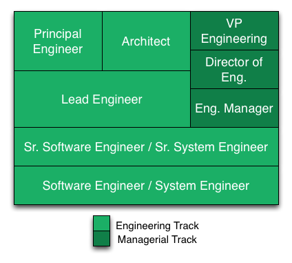

# Engineering Roles

* [Senior Engineering](#Senior Engineering)
* [Engineering Management](#Engineering Management)

## Software Engineer / System Engineer ##

*Note*:  Coming in the door, if a software engineer is fresh,
and/or young in his/her career we should assume that these skills are
not necessarily present and that they will need mentoring to develop
the skills outlined below.

### Solution Complexity ###

* Implement solutions whose complexity are at the scale single blocks of logic (e.g methods, functions, and procedures, queries)
* Implement solutions whose complexity involves integrating an navigating several components within an application.
* Implement additional components that fit into a larger pre-defined structure
* Implement solutions on top of existing or legacy code of afore mentioned complexity
*  Diagnose bugs and implement fixes of nominal complexity
*  Refactor unsustainably implemented code as encountered in the code base
* Demonstrate separation of concerns within their implementation (e.g. functions/methods/procedures, queries, user interface implementations are rarely broken down, with clear blocks of logic)

### Technical Fluency ###

* Solve problems using essential idioms involving one or two technologies (e.g. core unix tool, sql proficiency, idioms relevant to programming languages, user interface components, web interface components)
* Develop a deeper understanding of one or two technologies beyond superficial usage (e.g. peeking behind the curtain with ruby, rails, query execution, browser rendering, OS and/or platform understanding, etc)
* Recognize the use of software design patterns relevant to your area of focus
* Iterate and improve upon implementations given feedback
* Triage and diagnose bugs and application issues
* Create tests to capture essential implementation expectations
* Demonstrate understanding of the application lifecycle: considerations for logging, debugging and managing the application in its run-time state.
* Provide design documentation for the scope of implementation without having to implement the full solution first

### Leadership Skills ###

* Respond well to mentorship
* Contribute to larger projects when playing a supporting role on collaborative initiatives

### Team Skills ###

* Submit work for peer review and receive constructive feedback
* Participate in reviewing the work of peers and provide constructive feedback
* Demonstrate ownership over the success of applications
* Recognize and communicate need for additional support
* Communicate status on tasks and progress effectively
* Collaborate effectively within your team
* Collaborate effectively with other technical groups within the organization
* Participate in technical discussions

### Typical Years of Experience ###

* 0 - 3 years

--------

## Senior Software Engineer / Senior System Engineer ##

In addition to the skills expected of a _Software Engineer / System Engineer_

### Solution Complexity ###

* Implement solutions whose complexity can span an entire application and integrations with other applications.
* Able to translate a problem statement into a well defined application or series of components demonstrating software design best practices.
* Evolve the code base in substantial ways that increase simplicity, enable flexibility or drive new features, while still maintaining good software design principals
* Effective contributor within multiple code bases
* Diagnose bugs that may span multiple applications or services and drive cross application fixes

### Technical Fluency ###

* Provide constructive technical feedback when reviewing the work of peers
* Work effectively with technologies adjacent to the their application demonstrating holistic ownership and initiative
* Provide design documentation for the scope of implementation with sufficient thoroughness that the implementation can be handed off to 1-2 other engineers.
* Develop knowledge beyond core competency.
* Proactively make use of software design patterns relevant to your area of focus
* Navigate and become rapidly productive within unfamiliar code bases
* Rapidly engage with new technologies due to deep, productive exposure several technological tool sets.
* Undaunted when needing to work across multiple technologies.
* Reflexively considers software development best practices and application lifecycle management when developing solutions. (ex. how to test, how to debug, how to monitor, how to assess performance, etc.)

### Leadership Skills ###

* Provide mentorship for _Software Engineers_, interns or new hires
* Communicate effectively with non-technical business partners

### Team Skills ###

* Collaborate effectively with other technical _and non-technical_ groups within the organization
* Initiates technical discussions and frequently shares knowledge and practices within the team
* Regularly contributes and updates team knowledge base regarding the on-going management of systems

## Likely Years of Experience
2 - 5 years

# Senior Engineering

## Lead Engineer ##

In addition to the skills expected of a _Senior Software Engineer /
Senior Systems Engineer_

### Solution Complexity ###

* Understand multiple proposed solutions by Engineers and critically evaluate the merits of each solution to then synthesize them into a course of action (evaluate technical choices)
* Ensure that technical complexity is decomposed such that it can be distributed throughout the team reflecting individual technical abilities (ensuring the work can doled out matches the skills at the table, resource matching?)
* Sequence work such that it's delivered in the right order, considering delivery time, complexity, value, and risk.  (Technical Project  Implementation Management)

### Technical Fluency ###

* Effectively communicate and lead technical approach and direction to the project team
* Align technical solutions and approaches to business needs

### Leadership Skills ###

* Facilitate productive technical conversations within the team driving toward a convergence
* Responsible for the quality of the product coming from their projects
* Ensure the project team is adhering to best practices and software design patterns
* Ensure project team contributes and updates team knowledge base regarding the on-going management of systems
* Effectively lead project teams through project lifecycle
	*  _Planning_: ideation, definition, design
	*  _Execution_: coordination, execution, delivery
	*  _Iteration_: maintenance, sustainability, ability to iterate

### Team Skills ###

* Work effectively with other Lead Engineers to coordinate cross-functional technical efforts and external dependencies
* Engage product, architecture, and project management counter parts to balance approaches for solutions within a given area.
* Share knowledge about technical approaches and projects that are being undertaken within Engineering.

### Likely Years of Experience ###

4 - 7 years

## Principal Engineer / Architect ##

An equitable skill set is expected of either a Principal Engineer or an Architect. The key differentiator between the two title is the _role expectations_ for each position. In addition to the skills expected of a _Lead Engineer_

### Solution Complexity ###

* Demonstrate deep understanding of systems within an entire functional business area. (e.g. Enterprise, Consumer, Data and Analytics)
* Understands dependencies and integration points between functional business areas

----------------------
Yilmaz
* Considers company-scale ownership of solution integrity
* Defines vision and blueprints for cross-team integration of software
* Consulted on engineering focus (build vs buy?)

### Technical Fluency ###

* Easily familiarize and orient self within a new or different technology stack
* Effectively work within in any system within the organization.

### Leadership Skills ###

----------------------
Yilmaz
* Involved as a solution consultant across projects at the program level.

### Team Skills ###

----------------------
Yilmaz
* Works closely with architects to adhere to system blueprints.

----------------------
Yilmaz
* Communicates with stakeholders and owners of the largest systems.

### Role - Architect ###

### Role - Principal Engineer ###

### Likely Years of Experience ###

* 7 - 10 years of Experience

# Engineering Managerment

## Engineering Manager

## Director of Engineering

## VP of Engineering
